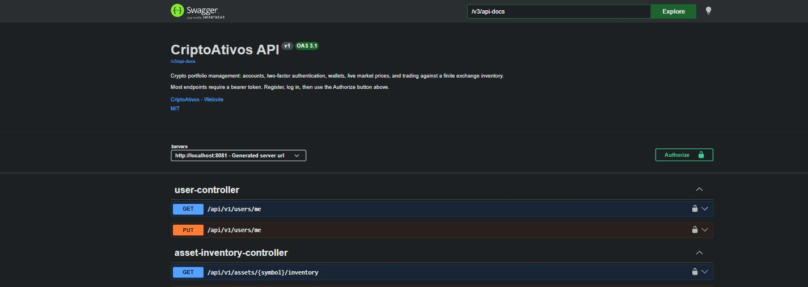

# CriptoAtivos API

A crypto portfolio management REST API: accounts with two-factor authentication, wallets, live market prices, and trading against a finite exchange inventory.

[](https://github.com/alvarogalhardo/CriptoAtivos/actions/workflows/ci.yml)


---

## Quickstart

Requires Docker and nothing else — no JDK, no Maven, no Postgres install.

```bash
git clone https://github.com/alvarogalhardo/CriptoAtivos.git
cd CriptoAtivos

# JWTs are signed with RS256. Keys are never committed, so mint a pair:
mkdir -p src/main/resources/certs
openssl genrsa -out src/main/resources/certs/private.pem 2048
openssl rsa -in src/main/resources/certs/private.pem -pubout -out src/main/resources/certs/public.pem

docker compose up --build
```

Then open **<http://localhost:8081/swagger-ui/index.html>**.

> The host port is 8081 because Docker Desktop's WSL relay commonly occupies 8080 on Windows. The container itself listens on 8080.

Prices populate from CoinGecko within five minutes of first start, or immediately if you set `PRICE_REFRESH_CRON`.



---

## Try it

`docs/api.http` is a runnable collection for the IntelliJ HTTP Client or the VS Code REST Client. Or by hand:

```bash
API=http://localhost:8081/api/v1

curl -X POST $API/auth/register -H 'Content-Type: application/json' \
  -d '{"name":"Ana Maria","email":"ana@example.com","password":"s3cret-passw0rd","cpf":"529.982.247-25"}'

TOKEN=$(curl -s -X POST $API/auth/login -H 'Content-Type: application/json' \
  -d '{"email":"ana@example.com","password":"s3cret-passw0rd"}' | jq -r .accessToken)

curl -X POST $API/wallet/deposits -H "Authorization: Bearer $TOKEN" \
  -H 'Content-Type: application/json' -d '{"amount":10000.00}'

curl -X POST $API/transactions/buy -H "Authorization: Bearer $TOKEN" \
  -H 'Content-Type: application/json' -d '{"symbol":"BTC","quantity":0.01}'

curl $API/wallet -H "Authorization: Bearer $TOKEN"
```

```json
{
  "cashBalance": 9228.84,
  "investedValue": 771.16,
  "marketValue": 771.16,
  "totalValue": 10000.00,
  "unrealisedPnl": 0.00,
  "unrealisedPnlPct": 0.0000,
  "holdings": [
    {
      "symbol": "BTC",
      "name": "Bitcoin",
      "quantity": 0.01000000,
      "averageCost": 77116.00000000,
      "currentPrice": 77116.00000000,
      "investedValue": 771.16,
      "marketValue": 771.16,
      "unrealisedPnl": 0.00,
      "unrealisedPnlPct": 0.0000
    }
  ]
}
```

---

## Features

- **JWT authentication** — RS256, stateless. The public key verifies tokens without being able to mint them.
- **TOTP two-factor** — RFC 6238, works with any authenticator app. Ten single-use recovery codes; secrets encrypted at rest.
- **Exact money** — `BigDecimal` end to end, `NUMERIC` in Postgres. No `double` anywhere in the codebase.
- **Atomic trading** — buy and sell are all-or-nothing, with pessimistic row locks so concurrent trades cannot overdraw a wallet or oversell supply.
- **Live market data** — CoinGecko prices refreshed on a schedule, behind a port so the domain never talks HTTP and the tests never touch the network.
- **Finite exchange inventory** — buys draw down real supply instead of assuming infinite liquidity.
- **Portfolio valuation** — cost basis, market value, and unrealised P&L per position and overall.
- **Admin operations** — user management with guardrails against self-deletion, removing the last administrator, and deleting accounts that still hold value.
- **RFC 7807 errors** — every failure is a `problem+json` document. No stack traces cross the wire.

---

## API

`POST /api/v1` prefix on everything. Full interactive docs at `/swagger-ui/index.html`.

| Method | Path | Auth | Description |
|---|---|---|---|
| `POST` | `/auth/register` | — | Create an account and its wallet |
| `POST` | `/auth/login` | — | Exchange credentials for a token, or a 2FA challenge |
| `POST` | `/auth/2fa/setup` | user | Begin enrolment; returns a provisioning URI |
| `POST` | `/auth/2fa/confirm` | user | Activate 2FA; returns recovery codes |
| `POST` | `/auth/2fa/verify` | challenge | Exchange a challenge for an access token |
| `POST` | `/auth/2fa/disable` | user | Turn 2FA off |
| `GET` `PUT` | `/users/me` | user | Read or update your profile |
| `GET` | `/assets` | — | Browse the catalogue (paged) |
| `GET` | `/assets/{symbol}` | — | One asset with its current price |
| `GET` | `/assets/{symbol}/inventory` | — | Available exchange supply |
| `POST` | `/assets` | admin | Add an asset |
| `PATCH` | `/assets/{symbol}/price` | admin | Set a price by hand |
| `PUT` | `/assets/{symbol}/inventory` | admin | Restock supply |
| `GET` | `/wallet` | user | Cash, positions, and unrealised P&L |
| `POST` | `/wallet/deposits` | user | Add cash |
| `POST` | `/wallet/withdrawals` | user | Remove cash |
| `POST` | `/transactions/buy` | user | Buy an asset |
| `POST` | `/transactions/sell` | user | Sell an asset |
| `GET` | `/transactions` | user | History, filterable by type, symbol and date |
| `GET` | `/admin/users` | admin | List and search accounts |
| `GET` `DELETE` | `/admin/users/{id}` | admin | Inspect or remove an account |
| `PATCH` | `/admin/users/{id}/role` | admin | Promote or demote |

---

## Architecture

Package by feature, not by layer — everything about wallets lives in `wallet`, everything about trading in `operation`.

```
com.criptoativos
├── auth/          login, JWT issuing, TOTP two-factor
├── user/          accounts and registration
├── admin/         administrative operations
├── asset/         catalogue, inventory, price providers
├── wallet/        balances, holdings, portfolio valuation
├── operation/     Operation → { Transaction, CashOperation }
├── common/        money, errors, validation, security helpers
└── config/        security, JWT, OpenAPI, scheduling, rate limiting
```

Controllers hold only HTTP concerns. Services own transaction boundaries and business rules. Entities own their own invariants — a `Wallet` cannot be overdrawn because `debit` refuses, not because a service remembered to check.

See **[docs/ARCHITECTURE.md](docs/ARCHITECTURE.md)** for the data model, the buy-transaction sequence, and the concurrency design.

---

## Design decisions

**`BigDecimal` everywhere, never `double`.** Binary floating point cannot represent `0.1`, so repeated arithmetic drifts. Cash is scale 2, quantities and prices scale 8, all rounded `HALF_EVEN` through a single `Money` class. The database mirrors it with `NUMERIC(19,2)` and `NUMERIC(19,8)`.

**Flyway owns the schema; Hibernate only validates it.** `ddl-auto: validate` means a mapping that drifts from the schema fails at startup rather than corrupting data quietly. It has already caught two real mismatches during development.

**Pessimistic locks, always wallet then inventory.** Money is the one place where retrying on an optimistic conflict is worse than simply waiting. A fixed acquisition order rules out deadlock between concurrent trades on different assets.

**JPA single-table inheritance, kept deliberately.** `Asset → CryptoAsset` and `Operation → {Transaction, CashOperation}` are inherited from the original coursework design. The second one earns its place: cash movements and trades are genuinely different operations over a shared record.

**A `PriceProvider` port.** The domain never depends on CoinGecko. Swapping providers changes one adapter; running offline is a config flag; and the entire test suite runs with no network.

**A 2FA challenge token is a distinct authority.** It carries `ROLE_2FA_CHALLENGE`, never `ROLE_USER`. Route rules use `hasAnyRole("USER","ADMIN")` rather than `authenticated()`, because a half-authenticated session must not reach protected endpoints — and a test pins that.

**Identical login failures, and the encoder always runs.** Unknown email and wrong password return the same message, and the password encoder is invoked even when no account exists, so response *timing* cannot enumerate accounts either.

**No Lombok.** Records cover DTOs and entities are explicit. The project opens and builds in any IDE with no plugin and no annotation processor.

---

## Configuration

Every value has a working development default. The first three **must** be changed before exposing an instance.

| Variable | Default | Purpose |
|---|---|---|
| `ADMIN_PASSWORD` | `change-me-immediately` | Password for the seeded administrator |
| `ENCRYPTION_PASSWORD` | `dev-only-change-me` | Encrypts TOTP secrets at rest |
| `JWT_PRIVATE_KEY` / `JWT_PUBLIC_KEY` | `classpath:certs/*.pem` | RS256 signing keys |
| `ADMIN_SEED_ENABLED` | `true` | Set `false` to skip seeding entirely |
| `ADMIN_EMAIL` | `admin@criptoativos.local` | Seeded administrator address |
| `PRICE_PROVIDER` | `coingecko` | `manual` disables all outbound network calls |
| `PRICE_REFRESH_CRON` | `0 */5 * * * *` | Price refresh schedule |
| `CORS_ALLOWED_ORIGINS` | `localhost:3000,localhost:5173` | Browser origin allow-list |
| `RATE_LIMIT_AUTH_PER_MINUTE` | `20` | Auth attempts per IP per minute |
| `DB_URL` / `DB_USER` / `DB_PASSWORD` | local Postgres | Database connection |
| `PORT` | `8081` | Listen port (compose pins `8080` in-container) |

Copy `.env.example` to `.env` — Compose reads it automatically.

**Known limitation:** rate limiting is in-process, which is correct for a single instance. Behind a load balancer it needs shared state such as Redis.

---

## Testing

```bash
./mvnw verify      # unit + integration, coverage gate, format check
```

Docker must be running: integration tests start a real PostgreSQL via Testcontainers rather than substituting an in-memory database that behaves differently.

- **`*Test`** — unit tests, no Spring context. Fast.
- **`*IT`** — integration tests, full context against real Postgres.

**172 tests. 94% line coverage, 86% branch.** The build fails below 85% / 75%.

Two worth reading:

```java
concurrentBuysCanNeverOverdrawTheWallet()      // 8 threads, balance affords one → exactly one wins
concurrentBuysCanNeverOversellTheInventory()   // 8 threads, supply of 3    → exactly three succeed
```

Both use a `CyclicBarrier` to force a genuine race and run without a test transaction, so they exercise real commits.

A note on that last point: several integration tests are deliberately **not** `@Transactional`. A test-managed transaction keeps the Hibernate session open and papers over `LazyInitializationException`, and it makes rollback assertions meaningless because nothing ever commits. `WalletReadIT` and `TransactionIntegrityIT` run the way production does. That is how the lazy-loading bug on `GET /api/v1/wallet` was found.

---

## Project history

This began as a university OOP exercise: a single-user console application that stored balances as `double` in a `HashMap` and printed "purchase successful" whether or not the purchase had succeeded.

- **`v0-academic-baseline`** — the version handed in: Maven, Oracle JDBC, DAO classes, a 9-option text menu.
- **`archive/console-draft`** — an earlier single-package draft that had never been committed anywhere.
- **`docs/legacy/`** — the original Oracle DDL, entity-relationship diagram, and data dictionary.

The rewrite kept the domain model and the OOP hierarchies that were worth keeping, and fixed what was not:

| Original behaviour | Now |
|---|---|
| `double` balances | `BigDecimal` with enforced scale |
| Failed purchase still recorded, success printed anyway | `@Transactional`; a failure records nothing |
| Sold at the price captured when the object was built | Sells settle at the current price |
| `HashMap<CriptoAtivo, Double>` with no `equals`/`hashCode` — buying twice made two entries | `holdings` table with a unique `(wallet, asset)` constraint |
| `Autenticacao` class with four fields and no methods | Spring Security, RS256 JWTs, TOTP |
| Passwords in plaintext | BCrypt |
| Non-numeric menu input caused an infinite loop | Bean Validation, RFC 7807 responses |
| No tests, no persistence, no logging | 172 tests, PostgreSQL, structured logging |

---

## License

MIT — see [LICENSE](LICENSE).
