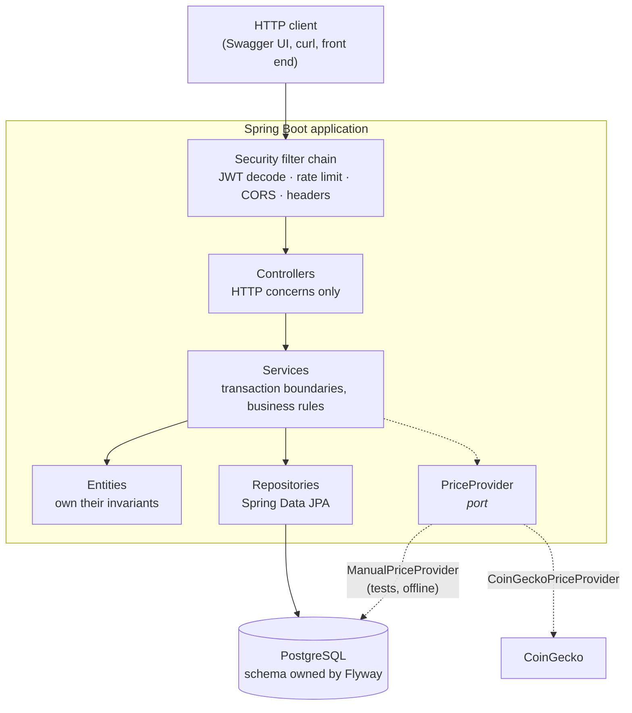
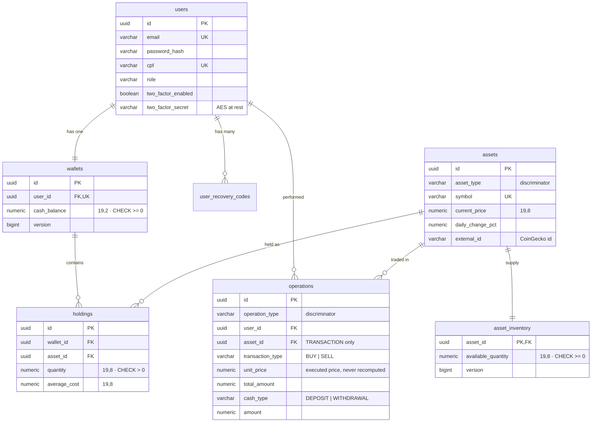
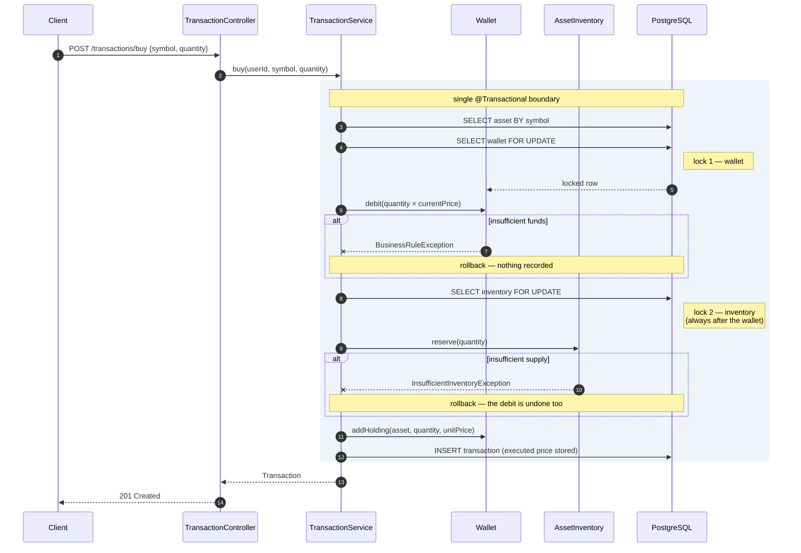
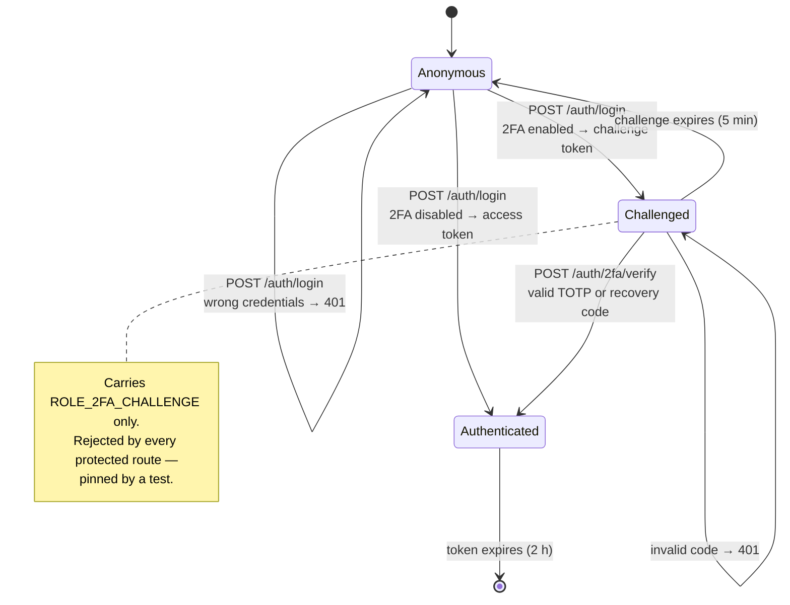

# Architecture

## Layers

Controllers never touch repositories. Services never build HTTP responses. The domain never imports anything from `org.springframework.web`.

Business invariants live on the entities, not in the services. `Wallet.debit` refuses to overdraw; `AssetInventory.reserve` refuses to oversell. A service that forgot to check could not create an invalid state even if it tried, and the database `CHECK` constraints are a third line of defence.

---

## Data model

Two single-table inheritance hierarchies, both inherited from the original design:

- `Asset → CryptoAsset` — one subclass today, but the discriminator and nullable columns mean a `StockAsset` needs no schema migration.
- `Operation → {Transaction, CashOperation}` — two real subclasses. Trades and cash movements are genuinely different events that share a user, a timestamp, and a description.

`holdings` and `asset_inventory` existed as Java classes (`CarteiraCriptoAtivos`, `EstoqueCriptoAtivos`) in the academic version but had no tables, so they constrained nothing. They are real now.

---

## Buying: the transaction

The price is snapshotted once at execution and written to the transaction row. History therefore never changes retroactively when the market moves — the original design read the price back off the asset, so past trades appeared to change price.

---

## Concurrency

Two row locks are involved in a trade, and **the order is always wallet, then inventory**. `TransactionService` is the only class that holds both. If any future code path reversed the order, two concurrent trades on different assets could deadlock — intermittently, and painfully hard to reproduce.

Pessimistic locking rather than optimistic is deliberate. Optimistic locking answers a conflict with "retry your request", which is the wrong answer for money: the caller has no idea whether their purchase happened. Serialising for a few milliseconds is better than a retry loop over a financial operation.

Three independent defences stop a balance going negative:

1. `Wallet.debit` throws before mutating.
2. The `FOR UPDATE` lock serialises concurrent access.
3. `CHECK (cash_balance >= 0)` in Postgres rejects it even if the first two were bypassed.

`TransactionIntegrityIT` proves the first two under real contention: eight threads released simultaneously by a `CyclicBarrier` against a balance that affords exactly one purchase, asserting exactly one succeeds.

---

## Authentication

Access tokens are RS256-signed, so the public key verifies without being able to mint. There is no `UserDetailsService` and no session: authentication is signature verification, not a database lookup per request.

TOTP secrets are AES-encrypted at rest and recovery codes are BCrypt-hashed, so a database dump alone cannot produce a valid second factor.

---

## Testing strategy

| | `*Test` | `*IT` |
|---|---|---|
| Spring context | no | yes |
| Database | none | real PostgreSQL (Testcontainers) |
| Runs in | `surefire` | `failsafe` |
| Speed | milliseconds | seconds |

Integration tests share one container and one cached Spring context, so the suite pays that cost once.

Most `*IT` classes are `@Transactional` and roll back. Three deliberately are **not**:

- **`TransactionIntegrityIT`** — rollback assertions are meaningless inside a test transaction, because the work is only flushed and never committed. Concurrency needs real commits visible across threads.
- **`WalletReadIT`** — a test transaction keeps the Hibernate session open, hiding `LazyInitializationException` that real callers hit with `open-in-view` disabled. This is how the lazy-loading bug in `GET /api/v1/wallet` was found.
- **`AdminUserIT`** — deletion cascades across four tables and the guardrails depend on committed state.

These clean up explicitly in `@AfterEach`. The extra bookkeeping buys tests that fail for the same reasons production would.
